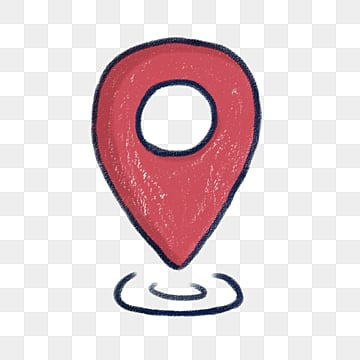
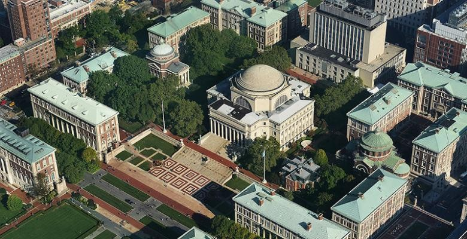

## Brief Self-introduction

------

 Hello from New York City & Salt Lake City!

I obtained my master of science degree in Electrical Engineering at Graduate School of Engineering and Applied Science @ Columbia University! 
As a Chinese, I started my overseas study in 2019 at the international summer school at PolyU @ HK, where I took elementary courses on artificial intelligence, and got a chance to play with AzureML. 
I then became an exchange student at the department of computer science, TUM @ Germany, where I involved myself in both VLSI design and deep computer vision lab. 
The lab was kind of tough, with only four members that semester. 
I was assigned the task of multiple object tracking across cameras.

I successfully reproduced a paper in 2020, on Megvii's challenge, and I am glad that I earned a few stars on GitHub. 
Reproduction is not just simply copying code from somewhere else, it's also an experiment and assessment.

During my master's study at Columbia, I joined the Kostic lab for a while with Prof. Zoran Kostic, on smart intersection topics, primarily focusing on unsupervised person and vehicle re-identification, as labeling is likely to be restricted by privacy. 
I expanded my experience further at NVIDIA Metropolis, during the following summer break, and my work was presented by Milind Naphade, CTO of Metropolis, at the GTC summit 2022.
I will publish a self-research paper on mobile person re-identification solution soon.

I worked as a teaching assistant in the department of computer science and electrical engineering for three times. 
Mentoring makes me a better communicator and writer.

While AI is my area of interest for a while, I also dive into data science and full-stack development. 
I won a few top rankings in machine learning and data science challenges. 
In February, I won the best beginner hack @ Columbia Hack.

I have experience with API design, microservices on cloud, web crawler and streaming processing.

As a recall, I would like to list my technical stacks below:
* Front-end: HTML/CSS/JavaScript(Google Map API), Django & Flask(Affiliated with Big Data Course)
* Back-end: Modern C/C++/CUDA/OpenCL, Python, Java(From Huawei), matlab and R
* Algorithm: OpenAI Gym, Tensorflow/Keras/Scikit learn/PyTorch, TensorRT/ONNX
* Cloud Platform: Amazon Web Service Lambda & Bucket, Google Cloud Platform & Big Query, Airflow, Git, AzureML
* Database: MySQL, SQLite, MongoDB, PostGreSql

Here I am in Manhattan, New York City! 

