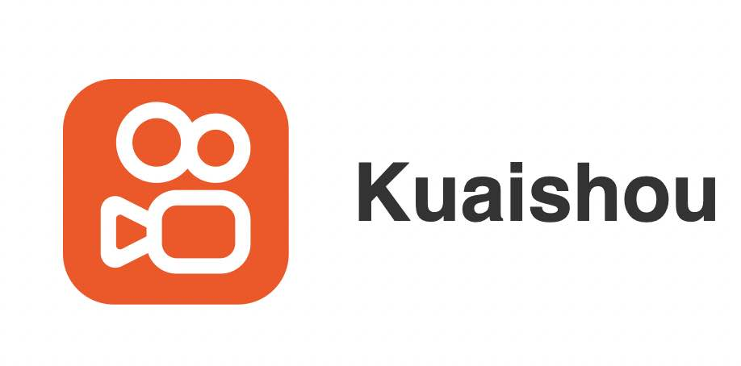

## Roles

----------
**Current**

* Software Engineer at  SoFi Inc.
* [Avalon](https://en.wikipedia.org/wiki/The_Resistance_(game)) enthusiast but alleviated by job-hunting... 

**Past**
* \[2019.8\] Completed summer international school at PolyU, Hong Kong, CN w/. scholarship
* \[2020.3\] Completed exchange at School of Informatics, Technical University of Munich, DE
* \[2020.6\] Graduated from School of Information Science and Engineering, Southeast University, CN w/. degree of B.Eng
* \[2020.10\] Given a hard time by unpleasant internship experiences at two institutions/companies...
* \[2021.4\] Rejected the software internship offer from productivity sector at  Kuaishou Tech. Probably one of the most regretful decisions in 2021
* \[2022.9\] Completed internship @ Metropolis, NVIDIA. Wonderful experience and great colleagues!
* \[2022.12\] Contributor of [AIModelShare platform](https://www.modelshare.org/)
* \[2023.5\] Associate II @ [Columbia SEAS in electrical & computer engineering](https://www.ee.columbia.edu/)