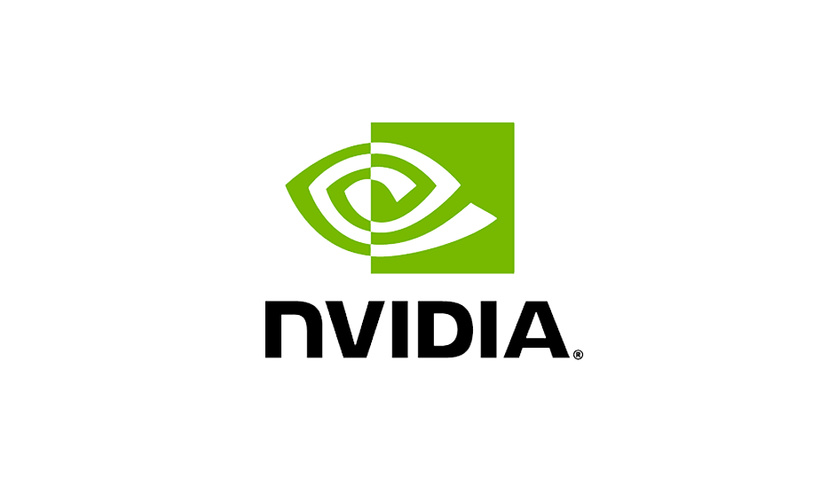

  

    
    

      <h1>Mingzhe Hu</h1>
      <h2>Software Engineer at SoFi | AI/ML Experience at NVIDIA & Columbia</h2>
      

        
        
        
      

    

  

  <h2>About Me</h2>

  

  
 <strong>Hello from New York City & Salt Lake City!</strong>

  
I started my overseas study in 2019 at the international summer school at PolyU @ HK, where I took elementary courses on artificial intelligence, and got a chance to play with AzureML. After that, I became an exchange student in my senior year at the department of computer science, TUM @ Germany, where I involved myself in both VLSI design and deep computer vision lab.

  
During my master's study at Columbia, I joined the Kostic lab for a while with Prof. Zoran Kostic, on smart intersection topics, primarily focusing on unsupervised person and vehicle re-identification. I expanded my experience further at NVIDIA Metropolis, during the following summer break, and my work was presented by Milind Naphade, CTO of Metropolis, at the GTC summit 2022.

  
<strong>Currently working as a full-time software engineer at SoFi</strong>, where I apply my expertise in AI/ML and full-stack development to build scalable financial technology solutions that help people achieve financial independence.

  <h3>Recent News</h3>

  

    <strong>2024</strong> 
    <strong>Oct. 22nd</strong>: Paper presented at ISVC 24' (Lake Tahoe, NV)
  

  

    <strong>2023</strong> 
    <strong>Jun. 20th</strong>: Joined SoFi as a full-time software engineer 
    <strong>Feb. 26th</strong>: Won best beginner hack at Columbia ADI Devfest Hackathon
  

  

    <strong>2022</strong> 
    <strong>Aug. 29th</strong>: Completed NVIDIA internship - BoT for MTMC tracking improved IDF1 from 40% to 81%+ 
    <strong>Apr. 4th</strong>: Accepted software summer internship at NVIDIA Metropolis
  

  <h2>Technical Skills</h2>

  | Programming Languages | Frameworks & Libraries | Data Engineering | Cloud & DevOps | AI/ML & Research |
  |----------------------|------------------------|------------------|----------------|------------------|
  | Python, Java, Kotlin | React.js, Django, Flask | Kafka, Airflow, Snowflake | AWS, Google Cloud Platform | PyTorch, TensorFlow, Keras |
  | C/C++, JavaScript | HTML/CSS | MySQL, PostgreSQL, MongoDB | Git, AzureML, MWAA | TensorRT, ONNX, OpenAI Gym |
  | CUDA, OpenCL | | SQLite | | Computer Vision, NLP |
  | Matlab, R | | | | |

  <h2>Professional Experience & Projects</h2>

  <h3>Current Position</h3>
  

    <strong>Software Engineer</strong> - SoFi (June 2023 - Present) 
    Full-time software engineer developing scalable financial technology solutions that help millions achieve financial independence.
  

  <h3>Previous Experience</h3>

  <strong>Research & Development:</strong>
  <ul>
    <li><strong>NVIDIA Metropolis</strong> (Summer 2022) - Multi-target multi-camera people tracking, improving IDF1 from 40% to 81%+</li>
    <li><strong>Columbia Kostic Lab</strong> (2022) - Smart intersection research focusing on unsupervised person and vehicle re-identification</li>
    <li><strong>Teaching Assistant</strong> - Columbia University (3 times) - Computer Vision and Deep Learning courses</li>
  </ul>

  <h3>Key Projects</h3>

  <strong>Computer Vision & AI:</strong>
  <ul>
    <li>Real-time Self-supervised Re-identification Algorithm and BoTs</li>
    <li>Real-time Single Camera Re-identification with Deep Convolutional GAN</li>
    <li>Strong Reinforcement Baseline on Atari Skiing with Imitation Learning</li>
    <li>Transformer Full Quantization for Text Classification</li>
  </ul>

  <strong>Full-Stack Development:</strong>
  <ul>
    <li>New York Traffic Heatmap with Google API, Tomtom Traffic and Spark Streaming</li>
    <li>Full Stack Application Demo with Modern C++ and SQLite</li>
    <li>NBA Award Prediction system with web scraping and big data analytics</li>
  </ul>

  <h3>Achievements</h3>
  <ul>
    <li><strong>Best Beginner Hack</strong> - 2023 Columbia ADI Devfest Hackathon</li>
    <li><strong>1st Place</strong> - Megvii CNN Quantization Workshop</li>
    <li>Published technical blog: <a href="https://medium.com/@mh4116_43123/a-milestone-in-object-detection-with-transformers-f2fd8a30cc32" target="_blank">A Milestone in Object Detection with Transformers</a> on Medium</li>
    <li>Work presented at GTC Summit 2022 by NVIDIA CTO</li>
  </ul>

  <h3>Open Source & Presentations</h3>
  <ul>
    <li><a href="https://www.youtube.com/watch?v=27G7Js6jO8I" target="_blank">Strong Baseline for Atari Games with Reinforcement Learning</a></li>
    <li><a href="https://www.youtube.com/shorts/ZIBe_ssFtm8" target="_blank">Manhattan Traffic Playback</a></li>
    <li>GitHub: <a href="https://github.com/SuperbTUM" target="_blank">SuperbTUM</a></li>
  </ul>

  <h3>Internal Sharing & Speaking</h3>
  <ul>
    <li><strong>Alumni Panel Speaker</strong> - Columbia CS Department (Nov 2024)</li>
    <li><strong>Internal Tech Talks</strong> - Topics include:
      <ul>
        <li>Kafka Snowflake consumer connector configurations introduction</li>
        <li>Java to Kotlin migration</li>
        <li>Modern Airflow best practices</li>
      </ul>
    </li>
  </ul>

  <h2>Publications</h2>

  

    <strong>Hu, M.</strong> "VLPSR: Enhancing Zero-Shot Object ReID with Vision-Language Model". In: <em>International Symposium on Visual Computing (ISVC)</em>, Lecture Notes in Computer Science, vol 15150. Springer, Cham.
    <a href="https://link.springer.com/chapter/10.1007/978-3-031-77389-1_5" target="_blank" style="color: var(--sofi-blue); font-weight: 600;">View Publication</a>
  

  <h2>Education & Courses</h2>

  <h3>Graduate Level - Columbia University</h3>
  

    <strong>Master of Science in Electrical Engineering</strong>
  

  <strong>Recent Coursework:</strong>
  <ul>
    <li><strong>ELEN 4720</strong> - Machine Learning in Signal, Information and Data</li>
    <li><strong>COMS 4995</strong> - Neural Network and Deep Learning</li>
    <li><strong>EECS 4750</strong> - Heterogeneous Computing with PyCUDA and PyOpenCL</li>
    <li><strong>EECS 6893</strong> - TPC in Big Data Analysis</li>
    <li><strong>ELEN 6889</strong> - Large Scale Stream Processing</li>
    <li><strong>EECS 6892</strong> - Reinforcement Learning in Information System</li>
    <li><strong>COMS 6998</strong> - Practical Deep Learning System Performance</li>
    <li><strong>COMS 4995</strong> - Design with C++ (lectured by Prof. Bjarne Stroustrup!)</li>
  </ul>

  <h3>Graduate Level - Technical University of Munich (TUM)</h3>
  

    <strong>Exchange Student - Computer Science</strong>
  

  <ul>
    <li>Seminar in Deep Computer Graphics</li>
    <li>Deep Computer Vision Lab: Optimization of DeepSort Tracker</li>
    <li>VLSI Design: Design of a MP3 player with Vivado and ModelSim</li>
  </ul>

  <h3>Undergraduate Level - Southeast University (SEU)</h3>
  <strong>Core Computer Science Courses:</strong>
  <ul>
    <li>Computer Network & Architecture</li>
    <li>Database Fundamentals with SQL</li>
    <li>Computer Vision with Halcon</li>
    <li>Signal Processing with Matlab</li>
  </ul>

  <h2>Contact Information</h2>

  

    
    <strong>Cottonwood Heights, UT & New York City, NY</strong>
  

  

    <a href="mailto:mingzhe.hu@columbia.edu?subject=[GitHub]%20Source%20Mingzhe%20Hu" class="contact-link">
      📧 Email
    </a>
    <a href="https://www.linkedin.com/in/humingzhe" target="_blank" class="contact-link">
      💼 LinkedIn
    </a>
    <a href="https://github.com/SuperbTUM" target="_blank" class="contact-link">
      💻 GitHub
    </a>
    <a href="resume/Resume_Engineering_II.pdf" target="_blank" class="contact-link">
      📄 Resume
    </a>
  

  
  
  

