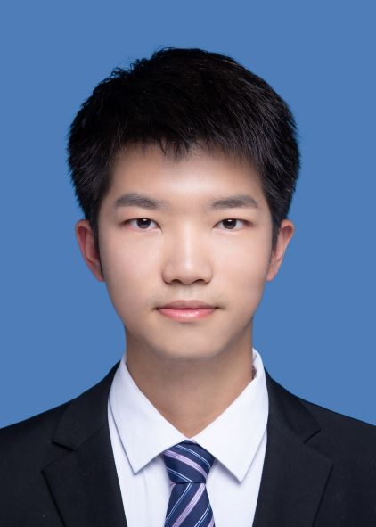
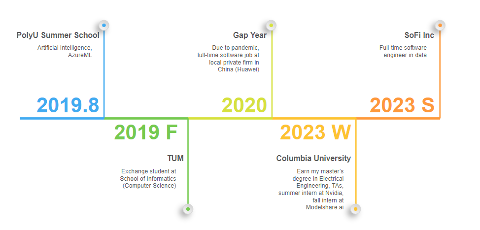

# Mingzhe Hu
## Software Engineer at SoFi | AI/ML Experience at NVIDIA & Columbia

---

## About Me

 Hello from New York City & Salt Lake City!

I started my overseas study in 2019 at the international summer school at PolyU @ HK, where I took elementary courses on artificial intelligence, and got a chance to play with AzureML. After that, I became an exchange student in my senior year at the department of computer science, TUM @ Germany, where I involved myself in both VLSI design and deep computer vision lab.

During my master's study at Columbia, I joined the Kostic lab for a while with Prof. Zoran Kostic, on smart intersection topics, primarily focusing on unsupervised person and vehicle re-identification. I expanded my experience further at NVIDIA Metropolis, during the following summer break, and my work was presented by Milind Naphade, CTO of Metropolis, at the GTC summit 2022.

Currently working as a full-time software engineer at SoFi, where I apply my expertise in AI/ML and full-stack development to build scalable financial technology solutions.

### Recent News

**2024**
- **Oct. 22nd**: Paper presented at ISVC 24' (Lake Tahoe, NV)

**2023**
- **Jun. 20th**: Joined SoFi as a full-time software engineer
- **Feb. 26th**: Won best beginner hack at Columbia ADI Devfest Hackathon

**2022**
- **Aug. 29th**: Completed NVIDIA internship - BoT for MTMC tracking improved IDF1 from 40% to 81%+
- **Apr. 4th**: Accepted software summer internship at NVIDIA Metropolis

### Technical Skills

| Programming Languages | Frameworks & Libraries | Data Engineering | Cloud & DevOps | AI/ML & Research |
|----------------------|------------------------|------------------|----------------|------------------|
| Python, Java, Kotlin | React.js, Django, Flask | Kafka, Airflow, Snowflake | AWS, Google Cloud Platform | PyTorch, TensorFlow, Keras |
| C/C++, JavaScript | HTML/CSS | MySQL, PostgreSQL, MongoDB | Git, AzureML, MWAA | TensorRT, ONNX, OpenAI Gym |
| CUDA, OpenCL | | SQLite | | Computer Vision, NLP |
| Matlab, R | | | | |

---

## Professional Experience & Projects

### Current Position
**Software Engineer** - SoFi (June 2023 - Present)
- Full-time software engineer developing scalable financial technology solutions

### Previous Experience

**Research & Development:**
- **NVIDIA Metropolis** (Summer 2022) - Multi-target multi-camera people tracking, improving IDF1 from 40% to 81%+
- **Columbia Kostic Lab** (2022) - Smart intersection research focusing on unsupervised person and vehicle re-identification
- **Teaching Assistant** - Columbia University (3 times) - Computer Vision and Deep Learning courses

### Key Projects

**Computer Vision & AI:**
- Real-time Self-supervised Re-identification Algorithm and BoTs
- Real-time Single Camera Re-identification with Deep Convolutional GAN
- Strong Reinforcement Baseline on Atari Skiing with Imitation Learning
- Transformer Full Quantization for Text Classification

**Full-Stack Development:**
- New York Traffic Heatmap with Google API, Tomtom Traffic and Spark Streaming
- Full Stack Application Demo with Modern C++ and SQLite
- NBA Award Prediction system with web scraping and big data analytics

### Achievements
- **Best Beginner Hack** - 2023 Columbia ADI Devfest Hackathon
- **1st Place** - Megvii CNN Quantization Workshop
- Published technical blog on object detection with transformers on Medium
- Work presented at GTC Summit 2022 by NVIDIA CTO

### Open Source & Presentations
- [Strong Baseline for Atari Games with Reinforcement Learning](https://www.youtube.com/watch?v=27G7Js6jO8I)
- [Manhattan Traffic Playback](https://www.youtube.com/shorts/ZIBe_ssFtm8)
- GitHub: [SuperbTUM](https://github.com/SuperbTUM)

### Internal Sharing & Speaking
- **Alumni Panel Speaker** - Columbia CS Department (Nov 2024)
- **Internal Tech Talks** - Topics include:
  - Kafka Snowflake consumer connector configurations introduction
  - Java to Kotlin migration
  - Modern Airflow best practices

---

## Publications

- **Hu, M.** "VLPSR: Enhancing Zero-Shot Object ReID with Vision-Language Model". In: *International Symposium on Visual Computing (ISVC)*, Lecture Notes in Computer Science, vol 15150. Springer, Cham. [https://doi.org/10.1007/978-3-031-77389-1_5](https://link.springer.com/chapter/10.1007/978-3-031-77389-1_5)

---

## Education & Courses

### Graduate Level - Columbia University
**Master of Science in Electrical Engineering**

**Recent Coursework:**
- **ELEN 4720** - Machine Learning in Signal, Information and Data
- **COMS 4995** - Neural Network and Deep Learning
- **EECS 4750** - Heterogeneous Computing with PyCUDA and PyOpenCL
- **EECS 6893** - TPC in Big Data Analysis
- **ELEN 6889** - Large Scale Stream Processing
- **EECS 6892** - Reinforcement Learning in Information System
- **COMS 6998** - Practical Deep Learning System Performance
- **COMS 4995** - Design with C++ (lectured by Prof. Bjarne Stroustrup!)

### Graduate Level - Technical University of Munich (TUM)
**Exchange Student - Computer Science**
- Seminar in Deep Computer Graphics
- Deep Computer Vision Lab: Optimization of DeepSort Tracker
- VLSI Design: Design of a MP3 player with Vivado and ModelSim

### Undergraduate Level - Southeast University (SEU)
**Core Computer Science Courses:**
- Computer Network & Architecture
- Database Fundamentals with SQL
- Computer Vision with Halcon
- Signal Processing with Matlab

---

## Professional Experience & Projects

### Current Position
**Software Engineer** - SoFi (June 2023 - Present)
- Full-time software engineer developing scalable financial technology solutions

### Previous Experience

**Research & Development:**
- **NVIDIA Metropolis** (Summer 2022) - Multi-target multi-camera people tracking, improving IDF1 from 40% to 81%+
- **Columbia Kostic Lab** (2022) - Smart intersection research focusing on unsupervised person and vehicle re-identification
- **Teaching Assistant** - Columbia University (3 times) - Computer Vision and Deep Learning courses

### Key Projects

**Computer Vision & AI:**
- Real-time Self-supervised Re-identification Algorithm and BoTs
- Real-time Single Camera Re-identification with Deep Convolutional GAN
- Strong Reinforcement Baseline on Atari Skiing with Imitation Learning
- Transformer Full Quantization for Text Classification

**Full-Stack Development:**
- New York Traffic Heatmap with Google API, Tomtom Traffic and Spark Streaming
- Full Stack Application Demo with Modern C++ and SQLite
- NBA Award Prediction system with web scraping and big data analytics

### Achievements
- **Best Beginner Hack** - 2023 Columbia ADI Devfest Hackathon
- **1st Place** - Megvii CNN Quantization Workshop
- Published technical blog on object detection with transformers on Medium
- Work presented at GTC Summit 2022 by NVIDIA CTO

### Open Source & Presentations
- [Strong Baseline for Atari Games with Reinforcement Learning](https://www.youtube.com/watch?v=27G7Js6jO8I)
- [Manhattan Traffic Playback](https://www.youtube.com/shorts/ZIBe_ssFtm8)
- GitHub: [SuperbTUM](https://github.com/SuperbTUM)

---

## Recent News

**2024**
- **Oct. 22nd**: Paper presented at ISVC 24' (Lake Tahoe, NV)

**2023**
- **Jun. 20th**: Joined SoFi as a full-time software engineer
- **Feb. 26th**: Won best beginner hack at Columbia ADI Devfest Hackathon

**2022**
- **Aug. 29th**: Completed NVIDIA internship - BoT for MTMC tracking improved IDF1 from 40% to 81%+
- **Apr. 4th**: Accepted software summer internship at NVIDIA Metropolis

---

## Contact Information

**Location:** Cottonwood Heights, UT & New York City, NY

**Email:** [mingzhe.hu@columbia.edu](mailto:mingzhe.hu@columbia.edu?subject=[GitHub]%20Source%20Mingzhe%20Hu)

**LinkedIn:** [linkedin.com/in/humingzhe](https://www.linkedin.com/in/humingzhe)

**GitHub:** [github.com/SuperbTUM](https://github.com/SuperbTUM)

**Resume:** [View PDF Resume](resume/Resume_Engineering_II.pdf)

---

